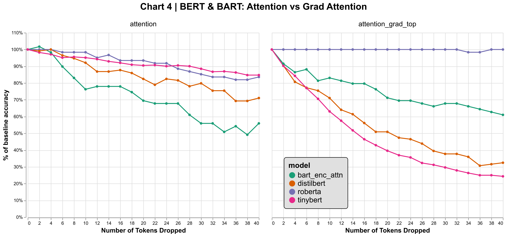

# Project Description
[TBA]

# Key Findings
[TBA]




# How to run experiments
[TBA]

# Code structure
[TBA]

# Environment setup
To create a working environemnt using conda:
```
conda env create -f dlt_project_env.yml
```

To activate the environment:
```
conda activate dlt_project_env
```

To update the environment in case you added new dependencies:
```
conda env update -f dlt_project_env.yml
```

Update the `requirements.txt` file:
```
pip list --format=freeze > requirements.txt
```